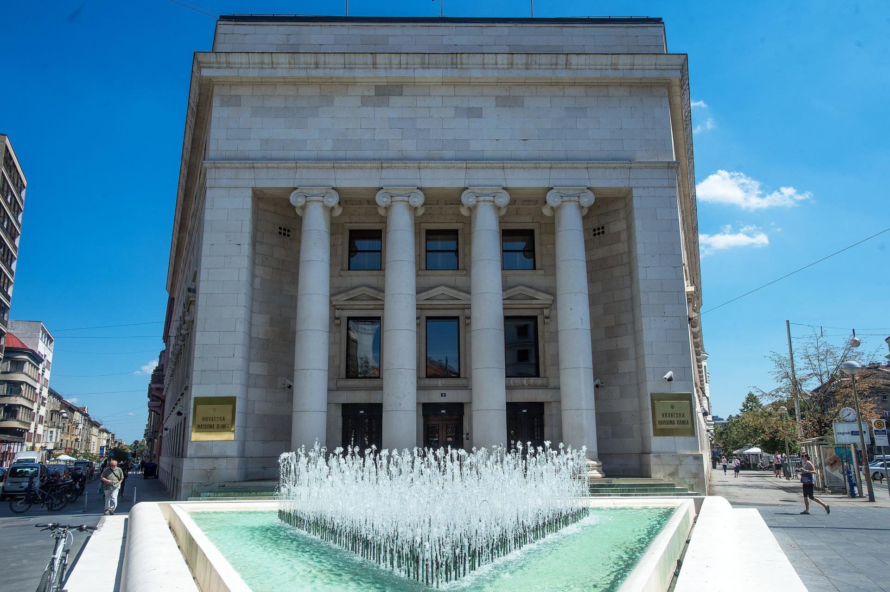

# HNB-Media-Map

# Analiza medijskog prostora Hrvatske Narodne Banke

Ovaj repozitorij sadrži sveobuhvatnu analizu medijske prisutnosti i javne percepcije Hrvatske narodne banke (HNB). Projekt predstavlja dubinsko istraživanje koje mapira ključne aktere, glavne teme, mjeri ton rasprave i analizira medijske odjeke značajnih događaja.
Istraživanje se sastoji od četiri tematska izvješća koja su međusobno povezana i sukcesivno se nadograđuju, pružajući postupno dublji uvid u strukturu, sadržaj i dinamiku online diskursa o središnjoj banci.

## Podatci i metodologija
Analiza predstavlja dio šireg projekta mapiranja medijskog prostora ključnih hrvatskih institucija.
Izvor podataka je baza podataka s preko 25 milijuna medijskih objava (populacija objava u digitalnom medijskom prostoru RH) iz koje su identificirani sve objave koje spominju HNB (~20k) .
Vremenski okvir za analizu je razdoblje  2021.–06/2024. godina.Primijenjene metode analize kombiniraju mrežne analize, obrade prirodnog jezika (NLP), tematskog modeliranja i analize sentimenta
    

## Struktura istraživanja

Ovdje možete pristupiti svakoj od četiri faze istraživanja.

### Faza 1: [Mapa medijskog ekosustava](https://raw.githack.com/lusiki/HNB-Media-Map/main/Mapa.html)

Odgovara na pitanja TKO u javnosti govori o HNB-u i GDJE se ta rasprava odvija. Analizira ključne aktere — od dužnosnika i političara do neovisnih analitičara — te identificira dominantne platforme i dinamiku njihovog utjecaja na javni diskurs.

### Faza 2: [Anatomija diskursa](https://raw.githack.com/lusiki/HNB-Media-Map/main/Teme.html)

Istražuje O ČEMU se govori. Kroz detaljnu tematsku analizu identificira i kvantificira ključne teme u raspravama o HNB-u, uključujući monetarnu politiku, uvođenje eura, financijsku stabilnost i javnu percepciju institucije.

### Faza 3: [Atmosfera diskursa](https://raw.githack.com/lusiki/HNB-Media-Map/main/Diskurs.html)

Analizira KAKO se o HNB-u govori. Mjeri emocionalni ton rasprave (stručan, kritičan, neutralan), razinu konflikta u jeziku te dominantne narativne okvire koji oblikuju javnu percepciju rada središnje banke.

### Faza 4: [Digitalni odjeci]()

Proučava KADA i ZAŠTO se diskurs o HNB-u intenzivira. Modelira kako ključni događaji — poput promjene kamatnih stopa, objave ekonomskih prognoza ili uvođenja eura — utječu na volumen, atmosferu i tematski fokus online rasprava.

##

Svako izvješće je interaktivno i omogućuje detaljno istraživanje podataka, pružajući korisnicima mogućnost samostalnog analiziranja medijskog diskursa o Hrvatskoj središnjoj banci.

----------------------------------------------------------------------------------------------------------
----------------------------------------------------------------------------------------------------------
(.beta;in developement)
[Imena](https://raw.githack.com/lusiki/HNB-Media-Map/main/Imena.html)
[Teme2](https://raw.githack.com/lusiki/HNB-Media-Map/main/Teme2.html)
----------------------------------------------------------------------------------------------------------
----------------------------------------------------------------------------------------------------------
